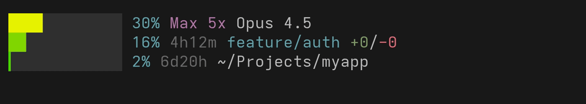
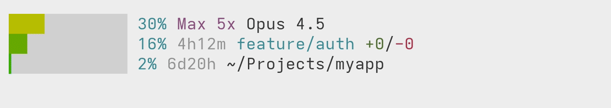

# HowMuchLeft

[](https://www.npmjs.com/package/howmuchleft)
[](https://www.npmjs.com/package/howmuchleft)
[](https://github.com/smm-h/howmuchleft/blob/main/LICENSE)

**Know exactly how much context and usage you have left, right in your Claude Code statusline.**





Three progress bars with sub-cell precision that shift from green to red as you approach your limits:

| Bar | What it tracks |
|---|---|
| **Context window** | How full your conversation is, plus subscription tier and model |
| **5-hour usage** | Rolling rate limit, time until reset, git branch and diff stats |
| **Weekly usage** | Rolling 7-day rate limit, time until reset, current directory |

Works with Pro, Max 5x, Max 20x, and Team subscriptions. API key users see context bar only.

## Install

Two commands and you're done:

```bash
npm install -g howmuchleft
howmuchleft --install
```

## Uninstall

```bash
howmuchleft --uninstall
npm uninstall -g howmuchleft
```

## Customize

Config lives at `~/.config/howmuchleft.json` (JSONC -- comments allowed). See [`config.example.json`](./config.example.json) for all options.

- **`progressLength`** -- bar width in characters (default 12)
- **`colorMode`** -- `"auto"`, `"truecolor"`, or `"256"`
- **`colors`** -- custom gradient stops and background colors per theme/color-depth combo

Preview your current gradient: `howmuchleft --test-colors`
